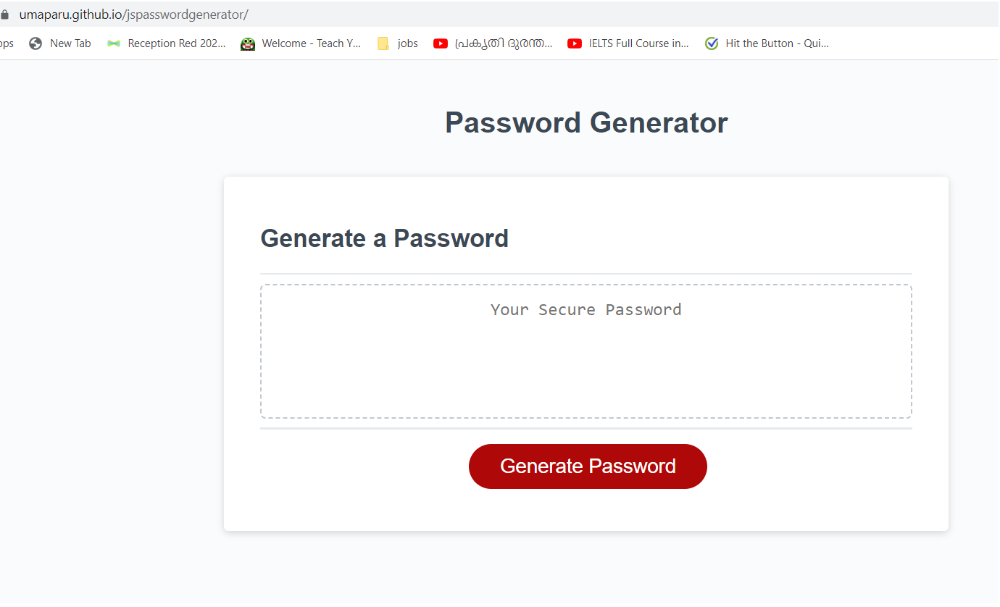
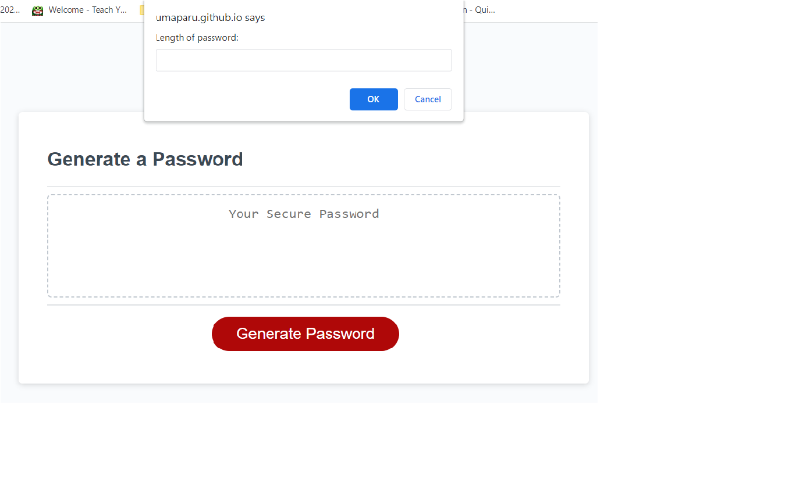
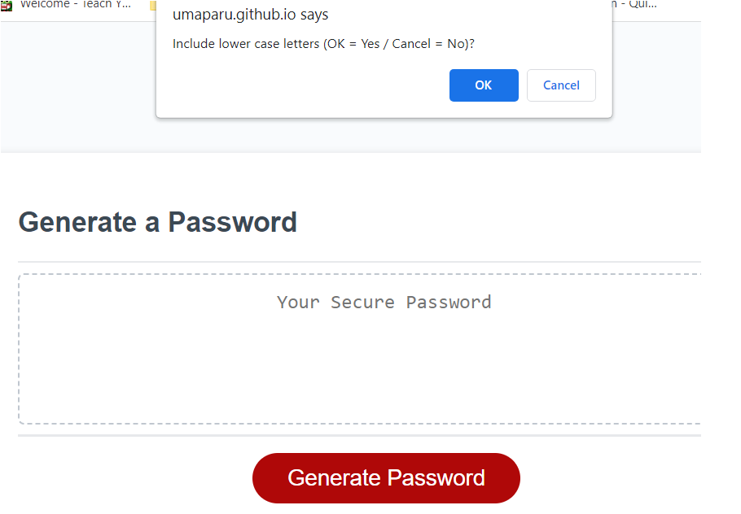

# Module 5 Challenge: Password Generator

## Overview
 
This week’s challenge requires you to create an application that an employee can use to generate a random password based on criteria they’ve selected by modifying starter code. This app will run in the browser, and will feature dynamically updated HTML and CSS powered by JavaScript code that you write. It will have a clean and polished user interface that is responsive, ensuring that it adapts to multiple screen sizes.

The password can include special characters. If you’re unfamiliar with these, see this [list of Password Special Characters from the OWASP Foundation](https://www.owasp.org/index.php/Password_special_characters).

## Instructions

The following image shows the web application's appearance and functionality:

* Generate a password when the button is clicked
  * Present a series of prompts for password criteria
    * Length of password
      * At least 10 characters but no more than 64.
    * Character types
      * Lowercase
      * Uppercase
      * Numeric
      * Special characters ($@%&*, etc)
  * Code should validate for each input and at least one character type should be selected
  * Once prompts are answered then the password should be generated and displayed in an alert or written to the page

### Deployment URL 

The deployed application can be accessed using below URL 

https://umaparu.github.io/jspasswordgenerator/

### Screenshots

The home page of Password Generator

Prompt for length

Prompt for lower case characters

Generated Password

---

© 2022 edX Boot Camps LLC. Confidential and Proprietary. All Rights Reserved.
